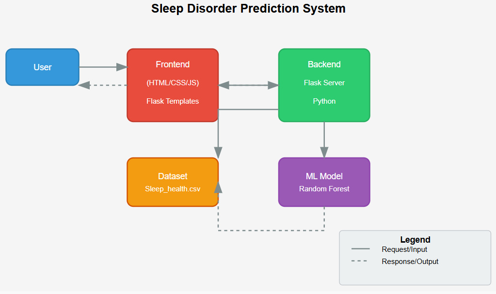

# Sleep Disorder Predictor 💤

A machine learning web application that predicts sleep disorders (Insomnia, Sleep Apnea) based on health metrics.

[](https://python.org)
[](LICENSE)

## 🌟 Features
- Instant sleep disorder prediction
- Detailed health analysis
- Clean, responsive interface
- Probability scores for predictions

## 🏗 System Architecture


## 🖥️ Screenshots
| Input Form | Prediction Result |
|------------|------------------|
| .png) | .png) |

## 🛠 Technologies
- **Frontend**: HTML, CSS, JavaScript
- **Backend**: Python, Flask
- **ML**: Scikit-learn (Random Forest)
- **Data**: Sleep Health dataset

## 📂 Files
``` bash
static/
├── sleeparchitecture.png
├── sleepout1(1).png
└── sleepout1(2).png
templates/
├── index.html
└── result.html
app.py
model.pkl
requirements.txt
```

## 🚀 Quick Start
```bash
# Clone and run
git clone https://github.com/UdayKiran110405/Sleep-Disorder-Predictor.git
cd Sleep-Disorder-Predictor
pip install -r requirements.txt
python app.py
```

## 📧 Contact
udaykiran83096@gmail.com - @UdayKiran110405
